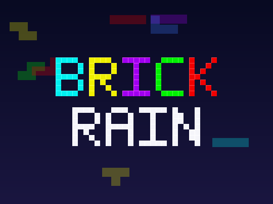

<p align="center">
  
</p>

<h1 align="center">BrickRain</h1>

<p align="center">A falling-blocks game for Roku TV — pixel art, chiptune sound, zero network.</p>

<p align="center">
  <a href="https://github.com/HectorIFC/BrickRain/actions/workflows/ci.yml"></a>
  
  <a href="https://github.com/HectorIFC/BrickRain/releases"></a>
  <a href="LICENSE"></a>
</p>

> A single-player falling-blocks game for Roku TVs, written in BrighterScript. Built as an
> open-source portfolio project demonstrating real Roku platform work: BrightScript/SceneGraph,
> a pure unit-tested game core, Rooibos testing, `roku-deploy` sideloading and CI/release
> automation. Fully offline — no network calls, no accounts, no data collection.

## Gameplay

<!-- Drag and drop gameplay.mp4 here in the GitHub editor when recorded — GitHub will host it and render an inline player -->

_Gameplay video on a real Roku TV — coming soon._

## Features

- The 7 standard tetrominoes from a shuffled **7-bag** randomizer (seedable for reproducible games).
- **Super Rotation System (SRS)** with standard wall kicks, a **ghost piece**, **hold** slot and a **next-3** preview.
- Lock delay (500 ms, reset-capped), soft/hard drop, DAS auto-shift, scoring, leveling and level-based well themes.
- **Leaderboard** persisted in the Roku registry: one best entry per nickname, ranked by score, surviving reboots.
- All 9 sound effects and all channel artwork are **original**, generated by the scripts in `tools/`.

## Controls

| Button | Action |
|---|---|
| Left / Right | Move piece |
| Down | Soft drop (hold to repeat) |
| OK | Rotate clockwise |
| Up | Hard drop |
| Rewind (◄◄) | Rotate counter-clockwise |
| Fast-forward (►►) | Hold piece |
| Play / Pause | Pause / resume |
| Back | Pause menu; from the menu, exit |

> Note: the Hold action is mapped to Fast-forward — the PRD lists Hold as a feature but assigns
> it no button, so the otherwise-unused fast-forward key was chosen.

## Quick start

### On a real Roku (developer mode)

```bash
git clone https://github.com/HectorIFC/BrickRain.git
cd BrickRain
npm install
cp .env.example .env          # set ROKU_DEV_TARGET (device IP) and ROKU_DEV_PASSWORD
npm run deploy                # builds and sideloads out/brickrain.zip
```

Enable developer mode first: on the remote press **Home ×3, Up, Up, Right, Left, Right, Left, Right**.

### Without a Roku (in the browser via brs-engine)

```bash
npm install
npm run build                 # produces out/brickrain.zip
npm run test:logic            # run the full logic suite headless (no device)
```

Drop `out/brickrain.zip` into the [brs-engine web app](https://lvcabral.com/brs/)
to play the channel in a browser.

## Testing & coverage

```bash
npm run lint                  # BrighterScript validation + bslint
npm run test:logic            # headless logic suite under brs-node (the CI gate)
npm run test:device           # Rooibos suite on a real Roku (host/password from .env), with coverage
```

The same shared test cases (`tests/cases/`) run two ways: headless under brs-node for CI, and
under **Rooibos** on a device for native code coverage. Policy: **target 100%, hard minimum 80%**
line coverage on `source/logic/`. The numeric gate is collected on-device (`npm run test:device`
emits lcov) because the brs-engine simulator's SceneGraph support is experimental; the headless
suite — which exercises every branch of the core — is the CI correctness gate.

Run the manual device checklist in [MANUAL_TESTING.md](MANUAL_TESTING.md) after UI changes.

## Architecture

BrickRain is a **pure functional core** plus a thin **imperative shell**:

- `source/logic/` — plain data in, plain data out, **no SceneGraph dependencies**: `board`,
  `piece` (SRS + kicks), `bag` (seedable 7-bag), `score`, `leaderboard`, and the `game` state
  machine. This is what makes the game testable without a device.
- `components/` — SceneGraph nodes that render the logic state and forward remote input
  (`MainScene` router, `LeaderboardScreen`, `NicknameDialog`, `GameScreen`, node-pooled
  `BoardView`, `SidePanel`, pause/game-over overlays).
- `source/registryAdapter.bs` — the only registry touch-point (persistence).
- `tools/` — Python generators for the original artwork and chiptune audio.

See [brickrain_prd.md](brickrain_prd.md) for the full product/architecture spec.

## Versioning & releases

Releases are automated from **Conventional Commits** on `main`:

- `feat:` → minor, `fix:` / `build:` / `chore:` → patch, `feat!:` / `BREAKING CHANGE:` → major.
- `.github/workflows/release.yml` computes the next tag, writes the version into the `manifest`,
  builds the channel and publishes a **GitHub Release** with `brickrain-vX.Y.Z.zip` attached —
  every release is directly sideloadable on a Roku in developer mode.

Contribution and commit conventions: see [CONTRIBUTING.md](CONTRIBUTING.md).

## License

[MIT](LICENSE) — all code, artwork and audio are original to this project.
